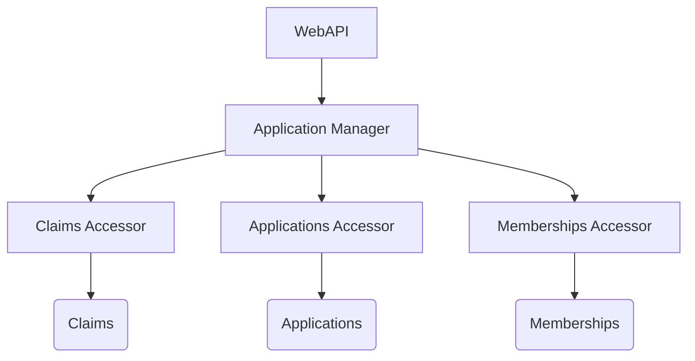
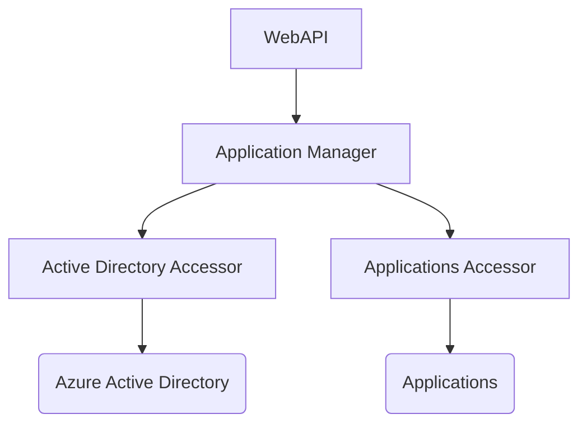
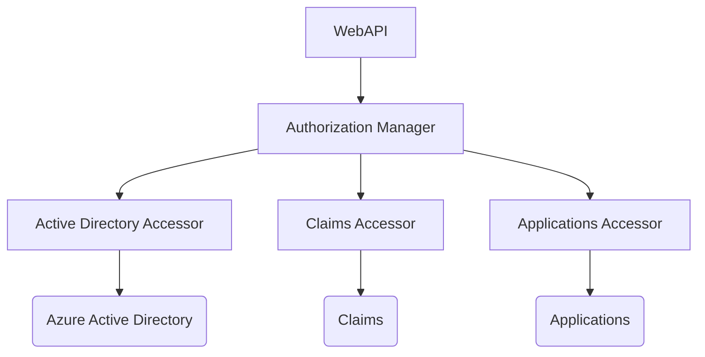

# Call Chains

- [CRUD an Application](#crud-an-application)
- [Get Application Users](#get-application-users)
- [CRUD a User](#crud-a-user)

## CRUD an Application

## Get Application Users

## CRUD a User

