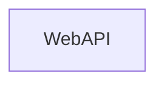
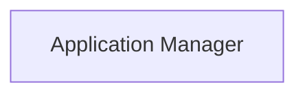
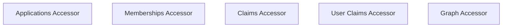
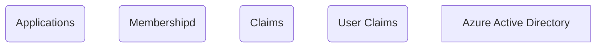

#Static Diagram

- [Static Diagram](#static-diagram)
- [Client](#client)
- [Managers](#managers)
- [Resource Access](#resource-access)
- [Resources](#resources)

## Client

## Managers

## Resource Access

## Resources

